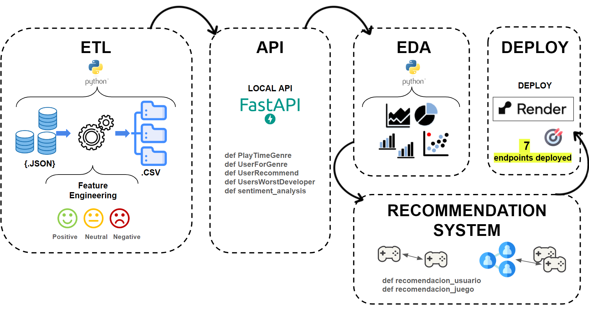

# 
Proyecto Individual N°1

### Índice
**Parte I: Sobre el Proyecto**
- Proceso detrás del proyecto

**Parte II: Estructura del Repositorio Github**
- Desglose detallado de la organización de archivos y carpetas

**Parte III: Contacto**
- Información para ponerse en contacto

---

### Introducción 

Este proyecto forma parte de la etapa de Labs para la carrera de Data Science de [Henry](https://www.soyhenry.com/). El proyecto utiliza data real de una plataforma multinacional de videojuegos llamada Steam y se desarrolla bajo un rol de **Data Scientist** para solucionar un problema de negocio.  

### Objetivo
El objetivo principal 🎯 es crear un sistema de recomendación de videojuegos para usuarios realizando un flujo de trabajo completo de MLOps para tener un Minimum Viable Product (MVP) al finalizar el proyecto. 

#### Objetivos Específicos
* Realizar la ingeniería de datos de los archivos fuente (ETL), incluye la ingesta de datos, el tratamiento (Feature Engineering) y su disponibilización.
* Creación de una API y el deployment de funciones como respuesta a preguntas de negocio.
* Presentación del Análisis exploratorio de los datos (Exploratory Data Analysis - EDA).
* Desarrollo del sistema de recomendación.

--- 

Este proyecto consta de tres fases: `Ingeniería de datos`, `Análisis exploratorio de los datos`, `Modelo de aprendizaje automático`.

🔍 Se recomienda leer los notebooks a los que se hace referencia a lo largo de este archivo, contienen información detallada de cada análisis.

---
### 1. Ingeniería de datos
`Data Engineering`: Para el proyecto se brinda 3 archivos JSON con datos anidados: australian_user_reviews , australian_user_items y output_steam_games. Además, un diccionario de datos con información de algunas variables de los datasets.

* [Carpeta Datasets + Diccionario](https://drive.google.com/drive/folders/1PvMb8F0veZYFmmcZytfVBNvmfzi6Rwl9?usp=drive_link)

### 1.1 ETL
Como primer paso se realiza el ETL de cada uno de los archivos proporcionados. El objetivo es preparar y disponibilizar los datos para su posterior análisis. Incluye la extracción de datos, tratamiento y carga.

### Extracción, Transformaciones y Carga

Se trabaja el ETL de los tres datasets en tres distintos **notebooks**. Los tres datasets se trabajan como dataframes los cuales se exploran, se realiza el tratamiento de nulos, duplicados, outliers y se utilizan técnicas de imputación de datos según el caso. Asimismo, con el objetivo de preparar los datos para el desarrollo de funciones para los endpoint de las consultas a desarrollar en la API, se considera solo columnas con información necesaria.

| Dataset | Descripción | Output|
| ------------ | ------------ |--------|
| australian_user_review   | Contiene información sobre las reseñas de los juegos hecho por los usuarios de la plataforma STEAM. La información que nos muestra es: user_id, user_url, reviews. | user_reviews_final.csv| Contiene información sobre los items (o juegos) jugados por los usuarios de la plataforma STEAM. La información que nos muestra es: user_id, user_url, y items.
| australian_user_items    | Contiene información sobre items. La información que nos muestra es user_id, items_count_steam_id, user_url, items. Cada 'items' de un usuario es una lista de diccionarios en formato JSON. Cada elemento de la lista contiene pares clave-valor (como "item_id", "item_name", "playtime_forever" y "playtime_2weeks").    |user_items_final.csv|
| output_steam_games   | Contiene el detalle sobre los juegos de la plataforma STEAM. La información que nos muestra es: 'publisher', 'genres', 'app_name', 'title', 'url', 'release_date', 'tags', 'reviews_url', 'specs', 'price', 'early_access', 'id' y 'developer'. Donde item_id es único.  |steam_games_final.csv

**Feature Engineering**: Se realiza un análisis de sentimiento con NLP en el dataset australian_user_review en el cual se clasifican las reseñas con los valores de 0: si es malo, 1: si es neutral y 2: si es positivo y se almacena en una nueva variable `sentiment_analysis`.

Nombre de los Notebooks del ETL:
* ETL_User_Reviews
* ETL_User_Items
* ETL_output_steam_games

Los outputs del ETL se encuentran en:
* [Carpeta Output ETL](https://drive.google.com/drive/folders/1ShuNW4ACMe9F5oz7omP5UigJ37ivj3Ec?usp=drive_link)

### 1.2 API

### Creación de funciones y desarrollo de la API
En esta parte se crean las cinco funciones para los endpoints que se consumirán en la API. 

Previamente realicé un preprocesamiento de los datasets que consistió en formar datasets con solamente la información que la función necesita. Esto se hizo con la finalidad de optimizar la ejecución de la API. 

Luego, creé las funciones que se implentan en los endpoints los cuales responden a preguntas relacionadas al análisis de datos de los juegos. Desde identificar el año con más horas jugadas para un género específico hasta proporcionar recomendaciones y evaluaciones de usuarios, estos endpoints cubren aspectos clave de la experiencia de juego y permiten una mejor comprensión del comportamiento de los usuarios y sus preferencias. Son las siguientes:

➔ Endpoint 1 (`PlayTimeGenre`): Devuelve año con mas horas jugadas para un género dado.

➔ Endpoint 2 (`UserForGenre`): Devuelve el usuario que acumula más horas jugadas para el género dado y una lista de la acumulación de horas jugadas por año.

➔ Endpoint 3 (`UsersRecommend`): Devuelve el top 3 de juegos más recomendados por usuarios para el año dado.

➔ Endpoint 4 (`UsersWorstDeveloper`): Devuelve el top 3 de desarrolladoras con juegos MENOS recomendados por usuarios para el año dado

➔ Endpoint 5 (`sentiment_analysis`): Según la empresa desarrolladora, se devuelve un diccionario con el nombre de la desarrolladora como llave y una lista con la cantidad total de registros de reseñas de usuarios que se encuentren categorizados con un análisis de sentimiento como valor.

El desarrollo de la API se hizo localmente con FastAPI para lo cual se creo un entorno virtual ("proyecto01_venv").

Nombre del Notebook previo a la creación de funciones:
* Previo_Funcion_sistema_recomendacion

Los inputs de las funciones se encuentran en:
* [Carpeta Input funciones](https://drive.google.com/drive/folders/1jPyN2m9EQJGm3RQzZoxpBWNvXzdJUwz4?usp=drive_link)

Archivo Notebook con definición de funciones:
* Funciones_endpoints

Archivos requeridos para la API:
* functions.py
* main.py

---

### 2. Análisis exploratorio de Datos 
`EDA`: Algunos de los aspectos clave que se exploró incluyen análisis descriptivo, identificación de valores atípicos (outliers o anomalías), visualizaciones de distribuciones para identificar tendencias, patrones, posibles correlaciones entre factores, entre otros.

*Nota: En este punto se hace foco a las distribuciones de las variables y las relaciones entre ellas, toda la limpieza (nulos, duplicados y faltantes) ya se desarrolló en la sección del ETL.

### 3. Modelo de aprendizaje automático

Sistema de Recomendación ítem-ítem (`recomendacion_juego`): 
Se implementó un sistema que recomienda juegos similares a un item. Previamente se trabajó un notebook (Previo_Funcion_sistema_recomendacion.ipynb) donde se preparó un dataset que contiene solo información relevante para crear el sistema. En este notebook se utilizó la similitud de cosenos utilizando vectores sobre l variables 'genres' y su previo traspase a variables dummies. Con cosine_similarity se creó la matriz de similitud de cosenos. Este método fue clave para determinar los cinco juegos recomendados similares al ingresado.

### 4. Deployment de la API
Se verificó la funcionalidad de los endpoints localmente y luego se deployó en RENDER para ser consumida desde la web . 

🚀 Link a la API deployada con Render: [LINK](https://proyecto-individual01-mlops-jimenez-v1.onrender.com)

### 5. Video Explicativo
La grabación contiene la **explicación** del proyecto,  una muestra la API deployada, todos los endpoints **correctamente** funcionando en Render, next steps y **recomendaciones** al proyecto.[LINK](https://drive.google.com/file/d/18tQ-hwa3Lbui2vWvT2FrjM8v_wXEFw1o/view?usp=sharing)

---
### Estructura del Repositorio
El reporitorio de divide de la siguiente forma:

> Carpeta Datasets: Contiene los 3 archivos iniciales .json y una carpeta de los archivos output del ETL.

> Carpeta Notebooks: Todos los notebooks (3 archivos del ETL, 1 del previo a las funciones, 1 previo al sistema de recomendación item-item, 1 previo al sistema de recomendación usuario-item, 1 del EDA y 1 de las funciones para los endpoints).

> Otros archivos: Archivos requeridos para el deployment en Render.

---
### Contacto
Autor: Anabel Jimenez

Enlaces para ponerse en contacto:
  - Correo Electrónico: [anabeljimenezh19@gmail.com](mailto:tu@email.com)
  - LinkedIn: [@AnabelJimenez](https://twitter.com/NuestraCuenta)
--- 
 

